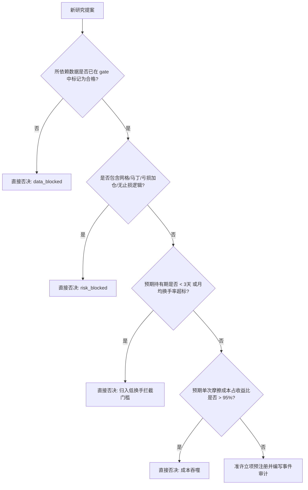

# 已淘汰策略“换壳”风险审查报告

**审查日期**：2026-07-12  
**仅新建**：`docs/rejected_strategy_relabeling_risk_2026-07-12.md`  
**审查目的**：防范后续研究员（或大语言模型代理）将已淘汰的策略进行“重新命名”、“指标替换”或“微调参数”后作为新策略重新申请立项（即换壳复活），浪费计算与审查资源。

---

## 一、失败簇（Failure Clusters）与换壳名称规避清单

基于本项目已确立的 15 个 `rejected` 案例，整理出以下重点防范的换壳名称与变体方向：

### 1. 成本吞噬型（Cost Devouring）
- **已被证伪机制**：在微观价差极薄（如 $<0.30\%$）的区间内做多腿或高频开平仓。
- **经典换壳名称示例**：
  - *“三角统计套利”* / *“跨期-期现多腿套利”*：本质上仍需承担四腿交易摩擦，成本仍然是 $\ge 0.32\%$。
  - *“小市值代币高波动基差捕获”*：试图转向山寨币做基差，但山寨币的现货/永续滑点比 BTC 宽数倍，摩擦直接翻倍。
  - *“自回归跨期均值回复”*：用复杂的数学公式（如 OU 过程）包装，但价差回归均值仍无法覆盖双腿往返费用。
- **开题前拒绝规则**：**凡是双边多腿往返、且预估平均单次盈利空间 $< 0.35\%$ 的任何新命名策略，一律在提案阶段直接拒绝，不进入代码审计。**

### 2. 前视偏差型（Look-Ahead Bias）
- **已被证伪机制**：在日内 K 线运行中，读取未结算的资金费率、当天未收盘的日线 OI 或大户多空比。
- **经典换壳名称示例**：
  - *“日线情绪共振过滤器”*：声称是过滤器不是策略，但在日内 15m bar 中提早判断当天的日线特征。
  - *“瞬时持仓突破”*：使用日线级别的 rubik OI 变化，但在日内 00:00 准时开仓（忽略了 16:00 UTC 的延迟数据发布点）。
- **开题前拒绝规则**：**凡是使用非 15m/1m 同源 K 线之外的数据，且未在数据加载层强制执行“信号可用时间（如 16:00 UTC）与入场时间（16:15 UTC）分离”的代码，直接判定为 invalid。**

### 3. 样本外衰减型（Out-of-Sample Decay）
- **已被证伪机制**：在短周期（15m/1h）内频繁交易，依靠在特定形成期（IS）调整参数指标达到完美曲线，但在样本外（OOS）由于市场风格切换而流血。
- **经典换壳名称示例**：
  - *“自适应布林-ATR通道反弹”*：实质上只是把被淘汰的 `range_regime_mean_reversion_family` 换了一个通道自适应公式，依然在 15m 震荡市中流血。
  - *“多因子横截面动量重整”*：把 90日 动量换成 60日/30日 动量，在样本外依然无法抵御大盘集体腰斩的系统性风险。
  - *“多重均线共振突破系统”*：把唐奇安通道换成 EMA/MACD 共振，在震荡市中依然会被频繁假突破双向打脸。
- **开题前拒绝规则**：**凡是持有期 $< 3$天、月均交易次数 $> 12$ 次的短线价格趋势/反转策略，在低换手率准入闸门（`low_turnover_research_gate`）前一律直接拦截，标记为 data_blocked/frozen。**

### 4. 事件集中度型（Event Concentration Bias）
- **已被证伪机制**：策略收益高度依赖 2024-11 单边大牛市，在正常月份基本无利可图。
- **经典换壳名称示例**：
  - *“宏观大选/减半周期精选趋势策略”*：通过人工挑选“只在 11 月和 3 月开仓”，强行剔除其余亏损月份。
  - *“金秋高胜率均值回归”*：利用时间过滤器，只保留特定暴利时段的回测。
- **开题前拒绝规则**：**凡是单个自然月的事件贡献率超过 25%，或者剔除 2024-11 单月收益后净期望值为负的策略，直接判定为 rejected，不予批准。**

### 5. 样本不足型（Insufficient Sample）
- **已被证伪机制**：指标阈值设得极高（如 3-sigma 之外），回测曲线完美，但一年仅有 1-2 次交易，不具统计显著性。
- **经典换壳名称示例**：
  - *“黑天鹅极端崩盘抄底”*：声称高胜率，但 2 年回测中仅有 3 笔交易，属于偶发事件，无法证明策略稳健性。
  - *“四倍标准差极端基差收敛”*：在 BTC 历史上几乎不触发，账面胜率 100% 但实盘无意义。
- **开题前拒绝规则**：**凡是在 365 天回测中有效事件数 $< 15$ 个的策略提案，一律判定为“样本不足”，不予通过。**

### 6. 风险受阻型（Risk Blocked）
- **已被证伪机制**：利用网格、马丁、不认赔锁仓、浮亏加仓来摊平进场均价，制造“高胜率”假象。
- **经典换壳名称示例**：
  - *“斐波那契仓位倍增管理”*：本质上就是马丁格尔，亏损后指数级加仓。
  - *“安全价格区间双向价值平摊”*：本质上就是双向网格，抗单至爆仓。
  - *“浮亏锁仓对冲复利”*：声称是“锁仓”不占用保证金，实质上是拒绝止损，将单边行情亏损无限递延。
- **开题前拒绝规则**：**凡是代码中包含“未触发平仓前在浮亏头寸上增加持仓”、“无全局硬性单笔止损”或“网格挂单”等逻辑的策略，直接判定为 risk_blocked，不进入回测流程。**

### 7. 数据受阻型（Data Blocked）
- **已被证伪机制**：使用无法免费、公开、同源复现的 365天 历史数据（如高频 OI、清算、新闻舆情）。
- **经典换壳名称示例**：
  - *“AI推特舆情极速情绪交易”*：无 365天 免费公开毫秒级舆情数据库。
  - *“清算爆仓单跟踪系统”*：无 OKX 官方免费清算历史归档。
- **开题前拒绝规则**：**凡是所依赖的数据未在 `reports/research_data_gate_post_download.json` 中被标记为合格的策略提案，一律判定为 data_blocked，拒绝立项，不得建议使用付费替代方案。**

---

## 二、开题前一票否决决策树（Decision Tree）

在接受任何新研究提案之前，系统必须运行以下只读审计核对表，任何一项不满足则直接一票否决：

---
*本报告由 Gemini 独立撰写，旨在保护项目免受换壳策略带来的开发与算力泄漏，未改动任何交易核心代码。*
