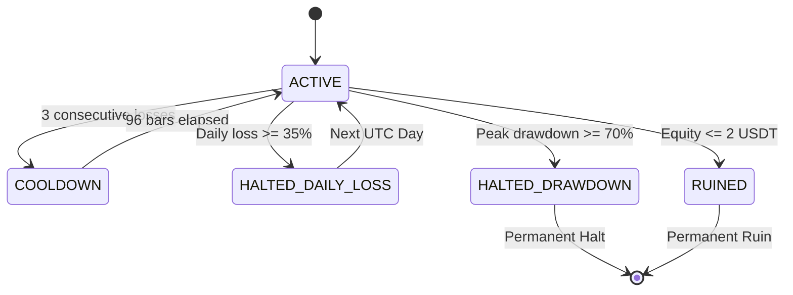

# "10U Warlord" Independent Capital Sleeve Contract v1

Implementation addendum: the configuration and per-symbol minimum-notional mapping are immutable. Minimum notionals must be bound from a verified frozen research protocol; a missing symbol fails closed without a fallback. Top-ups and main-account transfers have explicit rejection methods. `python ten_u_sleeve_v1.py` deterministically rebuilds the stress report. Isolated equity is floored at zero and any theoretical gap shortfall is recorded separately.

This document specifies the interface contract, constraints, state machine, and risk rules for the "10U Warlord" independent capital sleeve.

---

## 1. Risk Disclaimer & Purpose

> [!CAUTION]
> - **High Risk / High Leverage**: The "10U Warlord" sleeve is designed to operate with high risk (15% per trade) and leverage up to 5x. **The initial 10 USDT capital may be entirely lost (100% loss).** There is no principal preservation guarantee, implicit or explicit.
> - **Infrastructure ONLY**: This contract and its associated simulator define the **account model and capital isolation rules**. They do **not** represent a profitable strategy or signal. Real trading is **not** enabled.

---

## 2. Immutable Configuration Spec (v1)

The following parameters are frozen for the v1 model and produce a deterministic SHA-256 fingerprint:

* **Initial Equity**: `10.0` USDT
* **Risk Per Trade**: `15%` of current equity
* **Max Leverage**: `5.0` (5x)
* **Daily Loss Halt**: `35%` (equity drop within a single UTC day relative to the day's starting equity)
* **Peak Drawdown Halt**: `70%` (equity drop from the absolute peak equity of the account)
* **Ruin Threshold**: `2.0` USDT (equity drops to or below 2 USDT triggers permanent termination)
* **Consecutive Losses Cooldown**: `3` losses (triggers a cooldown of 96 K-lines / 24 hours)
* **Taker Fee**: `0.05%` per leg
* **Slippage**: `0.02%` per leg
* **Funding Cost Status**: `not_applied`
* **Isolated Account**: `true` (any deposit, top-up, or margin sharing from the main account is strictly forbidden)
* **Max Open Positions**: `1` (no concurrent positions)

---

## 3. Account State Machine

An account instance transitions through five states:

### State Definitions
1. **`ACTIVE`**: Normal trading state. New positions can be opened.
2. **`COOLDOWN`**: Temporary halt after 3 consecutive losses. New trades are skipped for **96 bars** (24 hours).
3. **`HALTED_DAILY_LOSS`**: Temporary halt when the day's equity drops by 35%. Resets and recovers to `ACTIVE` only at the start of the **next UTC calendar day**.
4. **`HALTED_DRAWDOWN`**: Permanent halt. Activated if equity drops 70% below the peak equity. **No recovery allowed.**
5. **`RUINED`**: Permanent ruin. Activated if equity drops $\le 2.0$ USDT. **No recovery allowed.**

---

## 4. worst-Case Budgeting & Position Sizing

To prevent fees and slippage from breaching the 15% risk budget, the maximum notional size is calculated before execution:

1. **Calculate Stop Loss Distance**:
   $$\text{stop\_loss\_pct} = \frac{|\text{entry\_price} - \text{stop\_price}|}{\text{entry\_price}}$$
2. **Calculate Total Worst-Case Cost Ratio**:
   $$\text{Total Cost Pct} = \text{stop\_loss\_pct} + \text{taker\_fee} + \text{slippage} + \left(\frac{\text{stop\_price}}{\text{entry\_price}}\right) \times (\text{taker\_fee} + \text{slippage})$$
3. **Budget Limit**:
   $$\text{notional\_by\_risk} = \frac{\text{equity} \times \text{risk\_per\_trade}}{\text{Total Cost Pct}}$$
4. **Leverage Limit**:
   $$\text{notional\_by\_leverage} = \text{equity} \times \text{max\_leverage}$$
5. **Execute Size**:
   $$\text{notional} = \min(\text{notional\_by\_risk}, \text{notional\_by\_leverage})$$
   - If $\text{notional} < \text{min\_notional}$ (for the specific coin defined in the protocol), the trade is skipped with reason `"SKIP_MIN_NOTIONAL"`.

---

## 5. Rationale for Strict Prohibitions

- **No Top-ups / Main Account Rescue**: The 10U sleeve is a high-risk sandbox. Allowing rescues or top-ups violates the mathematical independence of the test and hides strategy failures.
- **No Martingale / Cost Averaging**: Martingale, grids, and adding to losing positions are strictly forbidden as they create a high probability of rapid ruin (drawdown exceeding 70%).

---

## 6. Backtest & Walk-Forward Disciplines

1. **Protocol Binding**: All future strategies running in this sleeve must bind to the frozen backtest protocol of Task 1.
2. **Parameter Freeze**: Strategy parameters can only be optimized during the **Formation** phase. Once Formation is passed, parameters are frozen.
3. **No Retuning (OOS Failure)**: If a strategy fails validation or out-of-sample (OOS) testing, the parameters must be abandoned. Modifying parameters to "fix" OOS results is forbidden.
4. **Execution Isolation**: The sleeve is currently isolated from `runner.py`, paper trading, or live execution. It serves solely as an offline validation sandbox.
